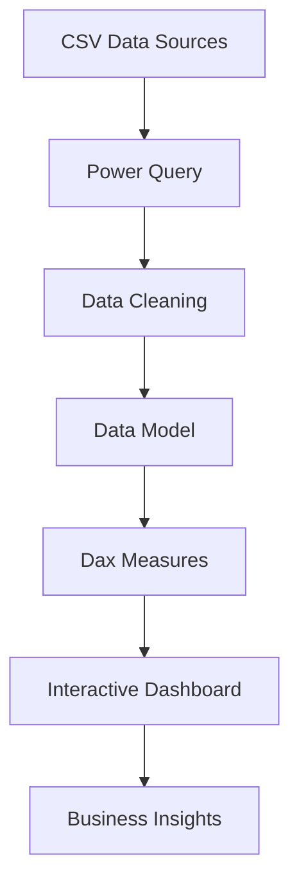
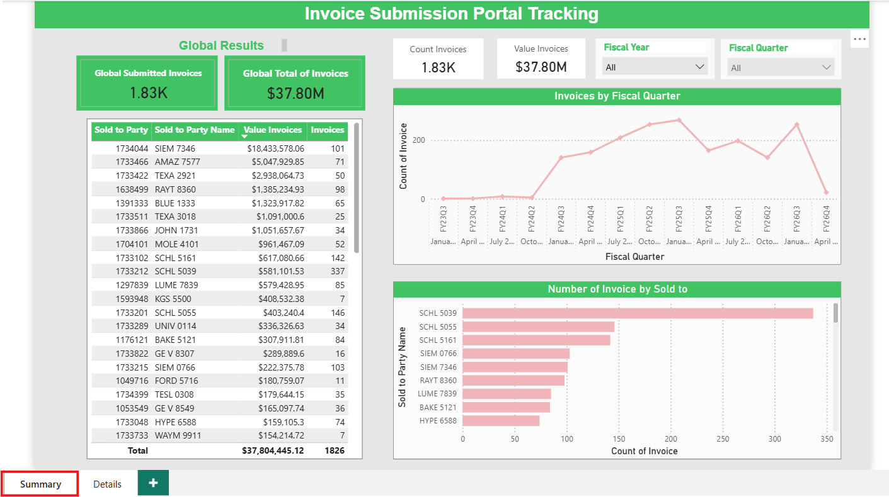
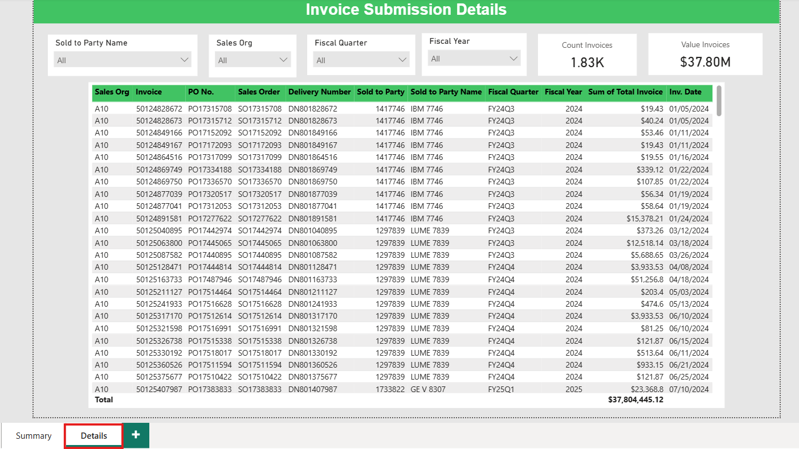
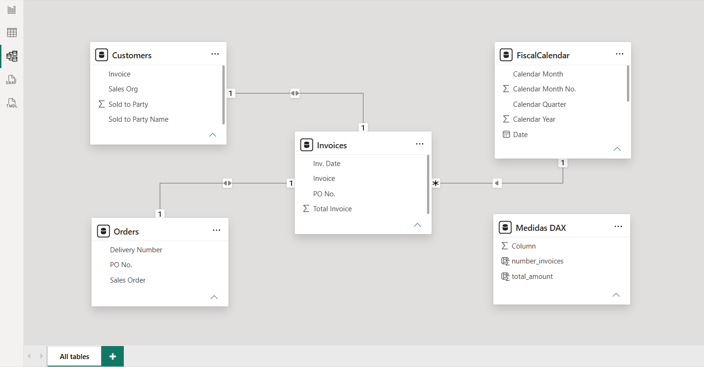

# Invoice Submission Dashboard
## 📊 Project Overview

This Power BI dashboard provides visibility into invoice submission activity by tracking submitted invoices across customer portals. It enables users to monitor invoice volume, submitted value, and customer-level performance through interactive visualizations and KPIs.

The dashboard consolidates invoice data into a centralized reporting solution, allowing finance and operations teams to quickly identify submission trends, monitor workload, and analyze invoice activity across customer accounts.

The project demonstrates data modeling, DAX calculations, Power Query transformations, and interactive dashboard design using Microsoft Power BI.

## 📂 Data Sources
The dashboard uses CSV files containing invoice submission data.

Example datasets include:
- Invoices.csv
    - Invoice
    - PO No.
    - Inv. Date
    - Total Invoice

-  Customers.csv
    - Invoice
    - Sold to Party
    - Sold to Party Name
    - Sales Org

- Orders
    - PO No. 
    - Sales Order
    - Delivery Number

NOTE: Sample data included in this repository has been anonymized

## 💼 Business Problem

Organizations often submit thousands of invoices through multiple customer portals. Without centralized reporting, it is difficult to answer questions such as:

- How many invoices have been submitted?
- Which customers receive the highest invoice volume?
- What is the total invoice value submitted?
- Which accounts require additional attention?
- How is submission activity changing over time?

Before this dashboard, answering these questions required manually reviewing Excel reports and filtering data across multiple files.

## ⚙️ Dashboard Features

The report automatically transforms raw invoice data into an interactive dashboard.

Key features include:

- Invoice Monitoring
    - Total invoices submitted
    - Total invoice value
    
- Customer Analysis
    - Invoice count by customer
    - Invoice value by customer
    - Top customers by submission volume

- Time Analysis
    - Invoice submissions over time
    - Quarterly / Yearly trends
    - Daily activity

- Interactive Filtering  
Users can filter the dashboard by:
    - Customer (Sold to Party Name)
    - Sales Org
    - Fiscal Quarter
    - Fiscal Year

## 📈 Key Insights
- Invoice submission volume
- Total submitted value
- Customer-level performance
- Submission trends over time
- Top customer accounts
- Interactive drill-down analysis
- Dynamic KPI cards
- Executive-ready reporting

## 🛠️ Technologies Used
- Microsoft Power BI
- Power Query
- DAX
- Data Modeling
- CSV Data Sources
- Interactive Visualizations
- Slicers & Filters
- KPI Cards

## 🔄 Dashboard Workflow

## 📸 Dashboard Preview
#### 📸 Dashboard Pages
Summary:
- This Dashboard page shows a snapshot of invoice details. 
    - Total Count of Invoices
    - Total Value of Invoices
    - Trend of Invoice submission over fiscal quarters
    - Number of Invoices per Customer
    - Number of Invoices value per Customer

Details:
- This Dashboard page shows the invoice details
    - This dashboard has some important filters:
        - Customer
        - Sales Org
        - Fiscal Quarter
        - Fiscal Year

#### 📐 Data Model
- This image shows the data relationship

## 📈 Project Highlights
- Interactive Power BI dashboard
- Automated KPI reporting
- Customer invoice analysis
- Dynamic filtering and drill-down
- DAX measures for business metrics
- Clean star-schema data model
- Reusable Power Query transformations
- Executive-friendly visual design

## 💼 Business Impact

This dashboard replaces manual invoice tracking with an interactive reporting solution that provides real-time visibility into invoice submission performance.

Key benefits include:
- Reduces manual reporting effort
- Improves visibility into invoice activity
- Enables faster customer analysis
- Supports operational decision-making
- Centralizes invoice reporting
- Simplifies KPI monitoring
- Easily scales to large invoice datasets

## ▶️ How to Run
1. git clone https://github.com/alangudi417/invoice-submission-dashboard.git
2. Open Invoice Submission Dashboard.pbix in Microsoft Power BI Desktop.
3. update the DataFolder parameter to point to the repository's data folder.
4. Refresh the data.
5. Explore the dashboard using the available slicers and filters.

## 📄 Notes
- Sample datasets included in this repository contain anonymized data to protect confidential business information.
- The report uses a Power Query parameter (DataFolder) so data paths can be updated easily without modifying individual queries.
